# API de Gestão de Contas a Pagar

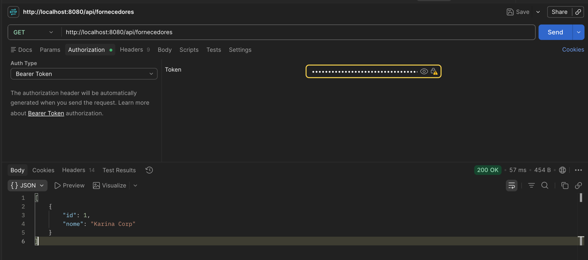

API REST para gestão de contas a pagar com importação assíncrona via CSV.

**Stack:** Java 17 | Spring Boot 3.3 | PostgreSQL | RabbitMQ | JWT | Docker

---

## 📋 Sumário

- [Como Executar](#como-executar)
- [Autenticação](#autenticação)
- [Exemplos de Uso](#exemplos-de-uso)
- [Decisões Arquiteturais](#decisões-arquiteturais)
- [Endpoints](#endpoints)

---

## 🚀 Como Executar

**Pré-requisitos:** Docker e Docker Compose instalados.

```bash
cd TotvusPayments
docker-compose up --build
```

✅ Aguarde: `Started PaymentsApplication`

**URLs:**
- 🌐 **API**: http://localhost:8080
- 📚 **Swagger**: http://localhost:8080/swagger-ui.html
- 🐰 **RabbitMQ**: http://localhost:15672 (guest/guest)
- 🗄️ **PostgreSQL**: localhost:5432 (payments/payments)

---

## 🔐 Autenticação

Todas as rotas (exceto `/api/auth/login`) requerem JWT Bearer Token.

### 1. Obter Token

```bash
curl -s -X POST http://localhost:8080/api/auth/login \
  -H "Content-Type: application/json" \
  -d '{"email":"admin@totvus.com","senha":"admin123"}' | jq .
```

**Resposta:**
```json
{
  "token": "eyJhbGciOiJIUzI1NiJ9..."
}
```

### 2. Usar em Requisições

```bash
TOKEN="<token-obtido-acima>"

curl -H "Authorization: Bearer $TOKEN" \
  http://localhost:8080/api/fornecedores
```

---

## 📊 Exemplos de Uso

### Fornecedores

#### Criar
```bash
curl -X POST http://localhost:8080/api/fornecedores \
  -H "Authorization: Bearer $TOKEN" \
  -H "Content-Type: application/json" \
  -d '{"nome": "Karina Corp"}'
```

#### Listar
```bash
curl http://localhost:8080/api/fornecedores \
  -H "Authorization: Bearer $TOKEN"
```

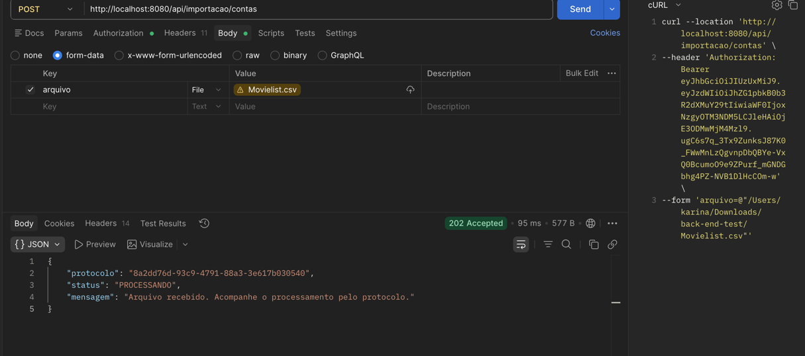

### Contas - CRUD Completo

#### Criar
```bash
curl -X POST http://localhost:8080/api/contas \
  -H "Authorization: Bearer $TOKEN" \
  -H "Content-Type: application/json" \
  -d '{
    "fornecedorId": 1,
    "dataVencimento": "2024-12-31",
    "valor": 1500.00,
    "descricao": "Fornecimento mensal"
  }'
```
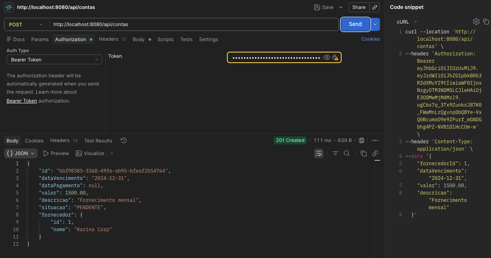

#### Buscar por ID
```bash
curl http://localhost:8080/api/contas/{id} \
  -H "Authorization: Bearer $TOKEN"
```
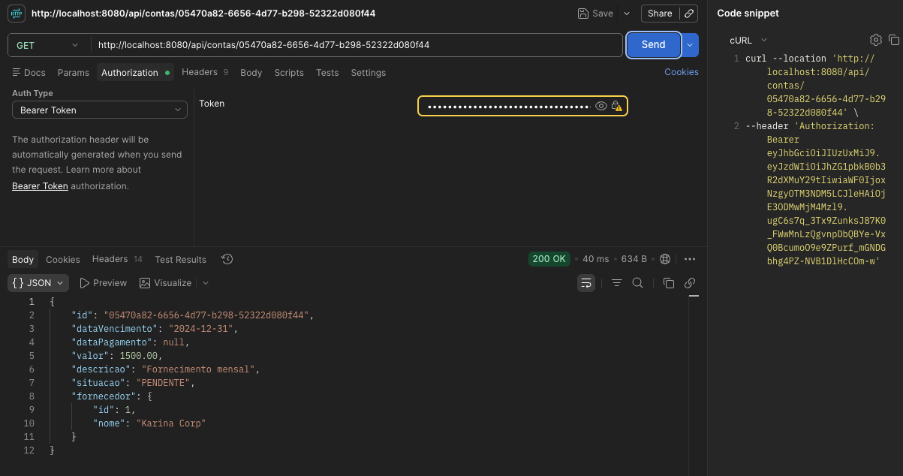

#### Listar com Filtros (Paginado)
```bash
# Com filtro por descrição
curl "http://localhost:8080/api/contas?descricao=fornecimento&page=0&size=10" \
  -H "Authorization: Bearer $TOKEN"

# Com filtro por período (data de vencimento)
curl "http://localhost:8080/api/contas?dataVencimentoInicio=2024-01-01&dataVencimentoFim=2024-12-31&page=0&size=10" \
  -H "Authorization: Bearer $TOKEN"
```
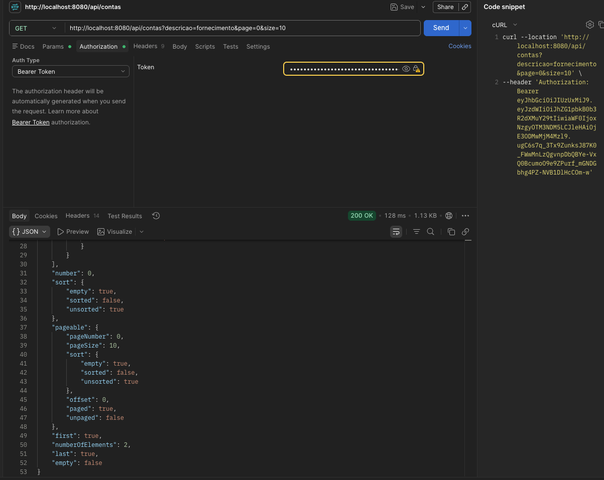

#### Atualizar
```bash
curl -X PUT http://localhost:8080/api/contas/{id} \
  -H "Authorization: Bearer $TOKEN" \
  -H "Content-Type: application/json" \
  -d '{
    "fornecedorId": 1,
    "dataVencimento": "2024-12-15",
    "valor": 2000.00,
    "descricao": "Fornecimento atualizado"
  }'
```
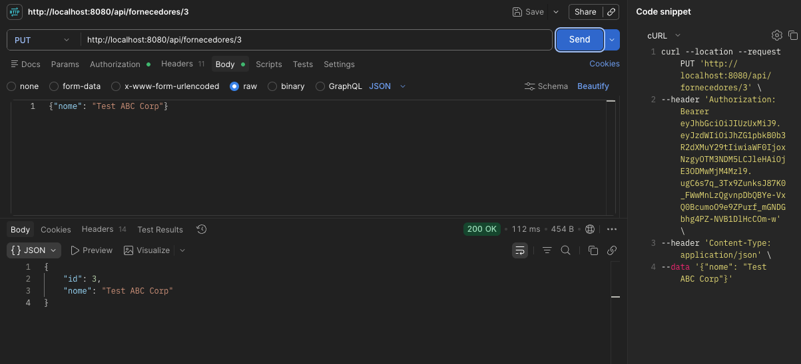

#### Alterar Situação (Máquina de Estados)
```bash
# PENDENTE → PAGO (data_pagamento é automática)
curl -X PATCH http://localhost:8080/api/contas/{id}/situacao \
  -H "Authorization: Bearer $TOKEN" \
  -H "Content-Type: application/json" \
  -d '{"situacao": "PAGO"}'

# PENDENTE → CANCELADO
curl -X PATCH http://localhost:8080/api/contas/{id}/situacao \
  -H "Authorization: Bearer $TOKEN" \
  -H "Content-Type: application/json" \
  -d '{"situacao": "CANCELADO"}'
```

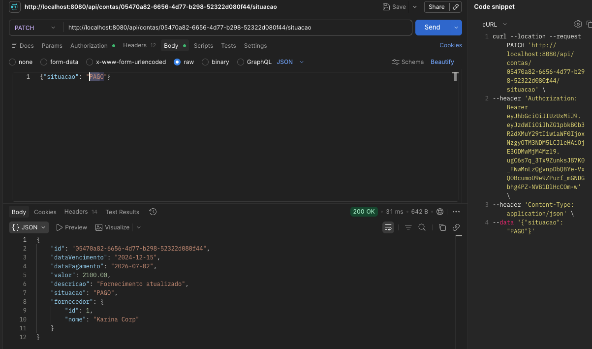

#### Deletar
```bash
curl -X DELETE http://localhost:8080/api/contas/{id} \
  -H "Authorization: Bearer $TOKEN"
```

### 📈 Relatório: Total Pago por Período

```bash
curl "http://localhost:8080/api/contas/relatorio/total-pago?inicio=2024-01-01&fim=2024-12-31" \
  -H "Authorization: Bearer $TOKEN"
```
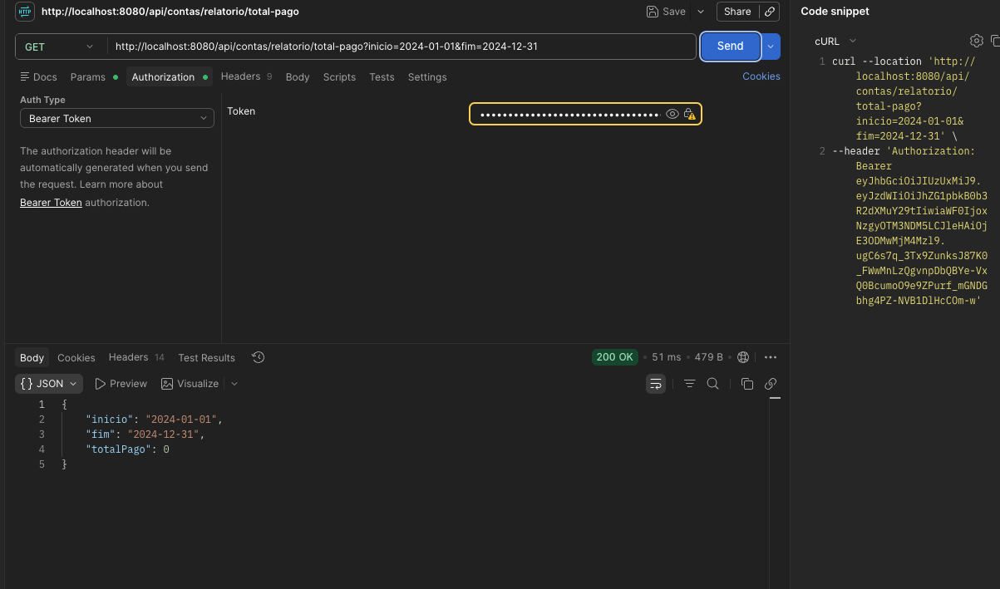

**Resposta:**
```json
{
  "inicio": "2024-01-01",
  "fim": "2024-12-31",
  "totalPago": 50000.00
}
```

### 📤 Importação Assíncrona (CSV)

#### Formato do CSV
```csv
fornecedorId,dataVencimento,dataPagamento,valor,descricao,situacao
1,2024-12-25,2024-12-20,1200.00,Material,PAGO
1,2024-11-20,,800.00,Limpeza,PENDENTE
2,2024-10-15,2024-10-10,450.50,Serviço,PAGO
```

#### Upload
```bash
curl -X POST http://localhost:8080/api/importacao/contas \
  -H "Authorization: Bearer $TOKEN" \
  -F "arquivo=@contas.csv"
```

**Resposta (HTTP 202):**
```json
{
  "protocolo": "abc123xyz",
  "status": "PROCESSANDO",
  "mensagem": "Arquivo recebido. Acompanhe o processamento em GET /api/importacao/abc123xyz"
}
```

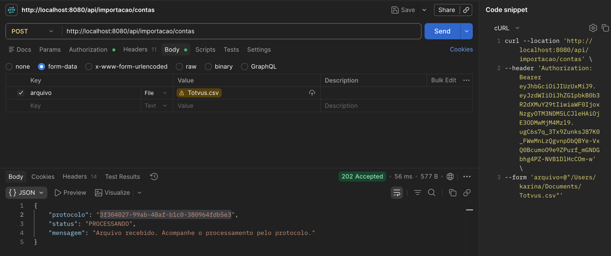

#### Verificar Processamento

O processamento é assíncrono (RabbitMQ), então o resultado não fica pronto na hora do upload. Consulte pelo protocolo:

```bash
curl http://localhost:8080/api/importacao/abc123xyz \
  -H "Authorization: Bearer $TOKEN"
```

**Resposta:**
```json
{
  "protocolo": "abc123xyz",
  "status": "CONCLUIDO_COM_ERROS",
  "totalLinhas": 4,
  "totalSucesso": 2,
  "totalErros": 2,
  "criadoEm": "2024-12-20T10:00:00",
  "atualizadoEm": "2024-12-20T10:00:03"
}
```

`status` pode ser `PROCESSANDO`, `CONCLUIDO`, `CONCLUIDO_COM_ERROS` (linhas individuais falharam, mas o job terminou) ou `FALHA` (erro crítico — CSV inválido, sem cabeçalho etc.). Para detalhar qual linha falhou e por quê, os logs continuam disponíveis:

```bash
docker logs -f payments-app | grep "Importação"
```
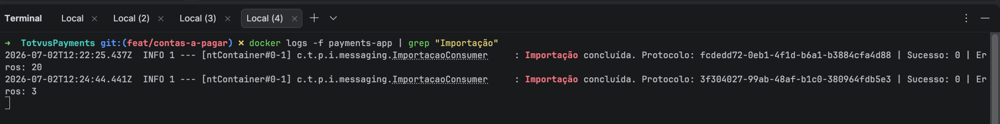

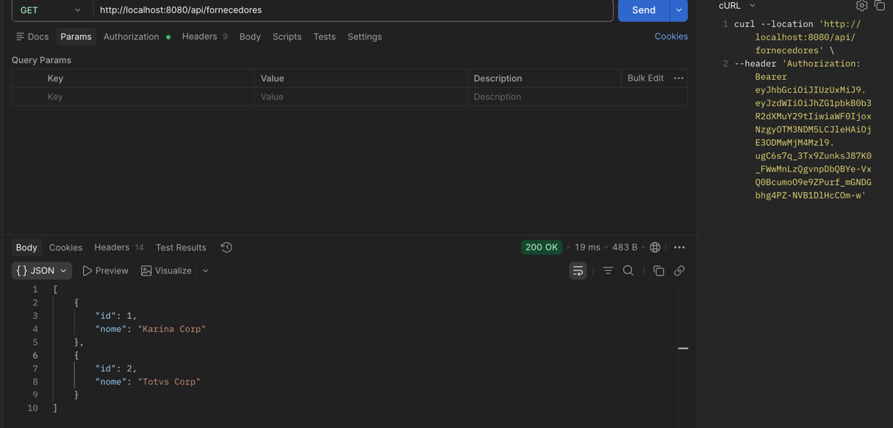

---

## 🏗️ Decisões Arquiteturais

### DDD (Domain-Driven Design)

O projeto segue Domain-Driven Design com 3 camadas bem definidas:

**Domain Layer** (`domain/`)
- Entidades: `Conta`, `Fornecedor`
- Value Objects: `SituacaoConta` (enum com máquina de estados)
- Exceções de domínio: `DomainException`, `TransicaoEstadoInvalidaException`
- **Responsabilidade:** Proteger invariantes e regras de negócio
- **Exemplo:** `Conta.criar()` é factory method que garante criação válida

**Application Layer** (`application/`)
- Services: `ContaService`, `FornecedorService`, `ImportacaoService`
- DTOs: Records imutáveis (`ContaRequest`, `ContaResponse`)
- **Responsabilidade:** Orquestrar use cases e validações de fluxo
- **Exemplo:** Verificar existência de fornecedor antes de criar conta

**Infrastructure Layer** (`infrastructure/`)
- Repositories: JPA com otimizações (@EntityGraph)
- Messaging: RabbitMQ Producer/Consumer
- Security: JWT e BCrypt
- **Responsabilidade:** Abstrair detalhes técnicos

**Web Layer** (`web/`)
- Controllers: REST endpoints
- GlobalExceptionHandler: tratamento de erros

### Prevenção de N+1 (Performance)

**Problema:** Listar 100 contas resultava em 101 queries (1 lista + 100 fornecedores)

**Solução:** `@EntityGraph` com JOIN FETCH
```java
@EntityGraph(attributePaths = {"fornecedor"})
Page<Conta> findAll(Specification<Conta> spec, Pageable pageable);
```

**Resultado:** 1 query com LEFT JOIN

**Benefícios:**
- ✅ Sem N+1
- ✅ Índices em data_vencimento, situacao, fornecedor_id
- ✅ DTOs reduzem serialização JSON

### Máquina de Estados (Validações de Domínio)

`SituacaoConta` enum protege transições válidas:

```
PENDENTE → {PAGO, CANCELADO}
PAGO → {} (estado final)
CANCELADO → {} (estado final)
```

**Qualquer transição inválida** → `TransicaoEstadoInvalidaException` (HTTP 422)

**Data de pagamento**: via API (`PATCH /situacao`), é automática (`LocalDate.now()`) ao transicionar para PAGO. Via importação CSV, se a coluna `dataPagamento` vier preenchida, ela é respeitada (permite importar histórico); se vier vazia, também cai no automático.

### Resiliência na Importação CSV

O processamento roda fora da requisição HTTP (RabbitMQ), então falhas parciais e falhas totais são tratadas de formas diferentes:

**Falha em uma linha específica (ex.: fornecedor inexistente, valor inválido):**
- `ImportacaoLineProcessor.processarLinha()` roda em transação própria (`@Transactional(propagation = REQUIRES_NEW)`)
- Isso é o que garante o isolamento: um `rollback` nessa linha **não desfaz** as linhas anteriores já commitadas na mesma mensagem
- A exceção é capturada por linha, logada como warning e o loop continua — o job termina com status `CONCLUIDO_COM_ERROS`

**Falha crítica (CSV vazio, sem cabeçalho, erro de leitura):**
- Não há linha para isolar — a mensagem inteira falha e é relançada
- RabbitMQ aplica retry automático com backoff exponencial (3 tentativas)
- Esgotadas as tentativas, a mensagem vai para a Dead Letter Queue e o job fica com status `FALHA`

**Acompanhamento:** cada upload gera um `protocolo` persistido (tabela `importacao_jobs`) com status `PROCESSANDO` → `CONCLUIDO` / `CONCLUIDO_COM_ERROS` / `FALHA`, consultável via `GET /api/importacao/{protocolo}` com contagem de sucesso/erros por linha (veja "Verificar Processamento" na seção Exemplos de Uso, acima).

**Configuração do retry/DLQ:**
```yaml
rabbitmq:
  listener:
    simple:
      retry:
        enabled: true
        max-attempts: 3
        initial-interval: 2000
        multiplier: 2.0
```

### Validações em 3 Camadas

1. **Contrato** (Bean Validation)
   - `@NotNull`, `@NotBlank`, `@DecimalMin`
   - Campos obrigatórios e formatos

2. **Fluxo** (Application Services)
   - Existência de fornecedor
   - Existência de conta
   - Transições de estado

3. **Domínio** (Entities)
   - Valores positivos (CHECK + código)
   - Descrição não-vazia
   - Máquina de estados

---

## 🔌 Endpoints

### Autenticação
| Método | Endpoint | Descrição |
|--------|----------|-----------|
| POST | `/api/auth/login` | Obter JWT token |

### Fornecedores
| Método | Endpoint | Descrição |
|--------|----------|-----------|
| POST | `/api/fornecedores` | Criar fornecedor |
| GET | `/api/fornecedores` | Listar fornecedores |

### Contas
| Método | Endpoint | Descrição |
|--------|----------|-----------|
| POST | `/api/contas` | Criar conta |
| GET | `/api/contas` | Listar contas (com filtros) |
| GET | `/api/contas/{id}` | Buscar conta |
| PUT | `/api/contas/{id}` | Atualizar conta |
| PATCH | `/api/contas/{id}/situacao` | Alterar situação |
| DELETE | `/api/contas/{id}` | Deletar conta |
| GET | `/api/contas/relatorio/total-pago` | Relatório (total pago) |

### Importação
| Método | Endpoint | Descrição |
|--------|----------|-----------|
| POST | `/api/importacao/contas` | Upload CSV (async) |
| GET | `/api/importacao/{protocolo}` | Consultar status do processamento |

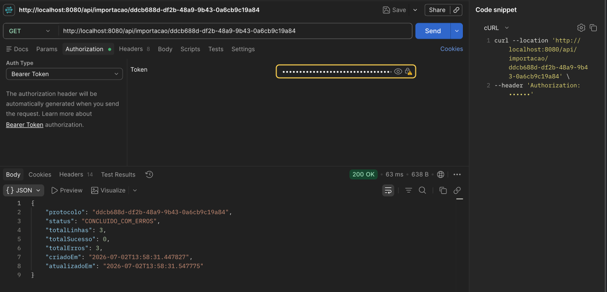
---

## 🧪 Testes

### Executar Testes Unitários
```bash
mvn test
```

**Testes implementados (32 no total):**
- ✅ `ContaTest.java` (11 testes — invariantes de domínio)
- ✅ `ContaServiceTest.java` (6 testes — regras de negócio)
- ✅ `FornecedorServiceTest.java` (5 testes)
- ✅ `ImportacaoJobTest.java` (4 testes — máquina de estados do job de importação)
- ✅ `ImportacaoServiceTest.java` (3 testes — criação e consulta de status do job)
- ✅ `ImportacaoLineProcessorTest.java` (1 teste — dataPagamento do CSV é respeitada)
- ✅ `ImportacaoConsumerTest.java` (2 testes — atualização do job em sucesso parcial e falha crítica)

---

## 📦 Stack Técnico

| Componente | Versão |
|-----------|--------|
| **Java** | 17 |
| **Spring Boot** | 3.3.0 |
| **PostgreSQL** | 16 |
| **RabbitMQ** | 3.13 |
| **Flyway** | 10.x |
| **JWT** | 0.12.5 |
| **Docker** | Latest |

---

## 🛠️ Estrutura do Projeto

```
src/
├── main/
│   ├── java/com/totvus/payments/
│   │   ├── domain/              # Regras de negócio
│   │   │   ├── model/           # Entidades
│   │   │   └── exception/       # Exceções
│   │   ├── application/         # Orquestração
│   │   │   ├── conta/
│   │   │   ├── fornecedor/
│   │   │   └── importacao/
│   │   ├── infrastructure/      # Detalhes técnicos
│   │   │   ├── persistence/     # JPA
│   │   │   ├── messaging/       # RabbitMQ
│   │   │   └── security/        # JWT
│   │   └── web/                 # HTTP
│   └── resources/
│       ├── db/migration/        # Flyway scripts
│       └── application.yml
└── test/
    └── java/...                 # Testes unitários
```

---

## 📝 Notas

- **Platform Support:** Dockerfile usa `eclipse-temurin:17-jdk` (imagem multi-arch, compatível com Linux/amd64 e Apple Silicon)
- **Senha Padrão:** admin123 (BCrypt hash armazenado)
- **JWT Expiration:** 24 horas
- **Open-in-View:** Habilitado para facilitar lazy loading

---

## 📞 Contato

Desenvolvido por: Karina Souza
GitHub: [KarinaApSouza2512/TotvusPayments](https://github.com/KarinaApSouza2512/TotvusPayments)